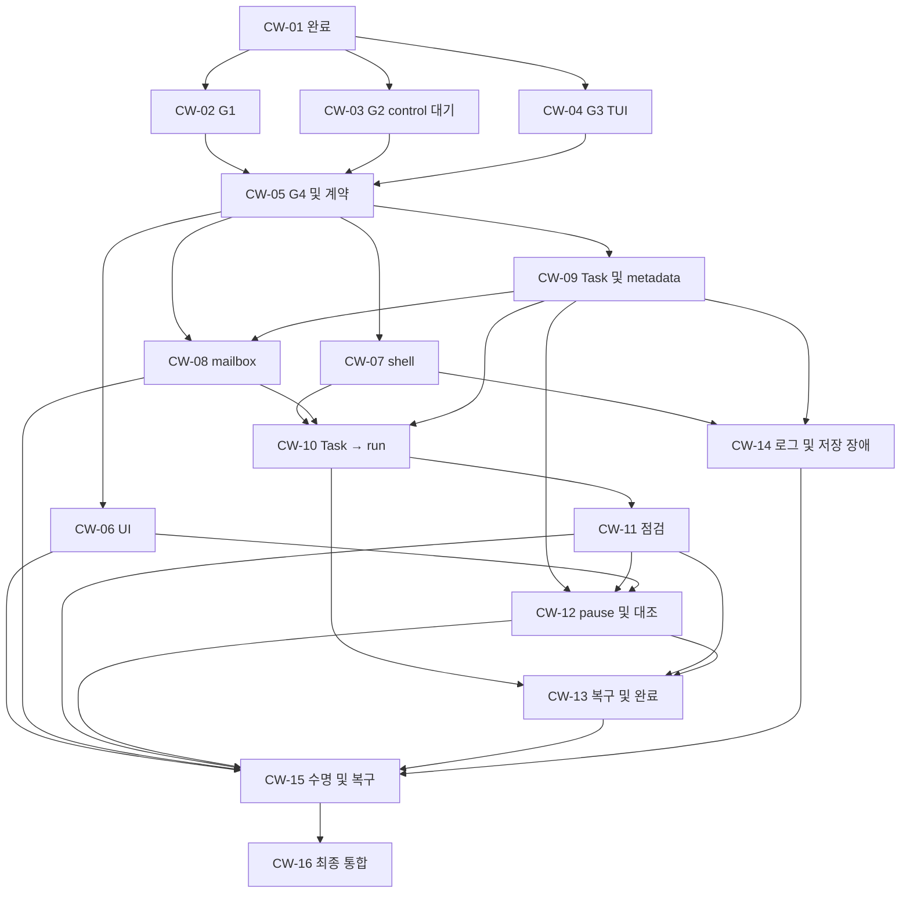

# Core Workbench — 구현 명세

Revision: s2.4; 상태: **r1.11/p2.4 정책 개정과 함께 구현 진행**. 작성일: 2026-09-24.
입력: [BRIEF r1.11](BRIEF.md), [진단 d2](DIAGNOSIS.md), [결정 C-D50~53](DECISIONS.md), [ADR-0002](../../adr/0002-managed-shell-control-wait.md).
개별 C-D50~52 답변과 r1.10/s2.3/p2.3 묶음의 사용자 승인은
[최초 구현 승인](../../../.workflow/core-workbench/runs/implement-p2.3-20260924/approval.json)에 보존한다.
C-D53 개정 승인은 [정책 개정 기록](../../../.workflow/core-workbench/runs/implement-p2.3-20260924/cd53-policy-approval.json)에 별도로 보존한다.
[기존 검토 후보](../../../.workflow/core-workbench/runs/planning-p2.3-20260924/manifest.json)와
[승인된 후보](../../../.workflow/core-workbench/runs/implement-p2.3-20260924/approved-manifest.json)의 digest를 구분한다. 이전 s2.2/p2.2 승인과 원문은
[승인 기록](../../../.workflow/core-workbench/runs/implement-p2-20260923/cd49-doc-final-approval.json)과
[이번 변경 전 원문](../../../.workflow/core-workbench/runs/planning-p2.3-20260924/before-documents.tar.gz)에 보존한다.

## 문제와 해결

사용자는 manager OMP와 목표·코드를 논의하고 worker에게 실험 실행·관측·보고를 맡긴다.
같은 host의 persistent terminal을 원본 OMP 두 개와 함께 보고 직접 제어할 수 있어야 한다.
Python backend가 세 PTY·작업·승인·관측·저장을 소유하고, 별도 Python frontend가 화면과 입력을
연결한다. 모델 호출은 기존 두 OMP가 담당한다. 최소 공개 TS extension과 Python 로컬 bridge가
메시지 전달·session 상태·turn 중단을 연결한다.

이번 개정의 목적은 실패한 초기 게이트를 동일한 수정 반복으로 다루지 않고 판별 가능한 작업으로
바꾸는 것이다. G2는 같은 interpreter의 control 대기, G1은 실제 resize 뒤 배치와 입력 보존,
G3는 실제 TUI에서의 전달 의미와 session 경합을 먼저 검증한다. 가정이 실패하거나 미확인이면
그 가정에 의존하는 production 확장을 보류한다. 사용자 행동을 바꿔야 하는 대안은 재합의한다.

## 관련 사용자 흐름

1. 사용자가 manager에 목표·허용 범위·완료 조건을 승인하고 진행을 지시하면 별도 AUTO ON 없이
   자동화를 시작한다. Manager가 명세와 실행 조건·코드·허용된 local commit을 준비한다.
2. Worker가 기준 commit의 별도 실행용 worktree와 선택 환경을 확인하고 같은 host shell에서
   실행·관측한다. Workbench가 관리 대상 프로그램의 종료·exit status 또는 unknown과 로그·결과
   위치를 기록하면, 종료 확인 뒤 worker가 사전 실험 기준에 따라 출처·내용·미확인을 대조해
   성공·실패·판단 보류의 1차 판단을 보고한다. Manager가 승인된 완료 조건으로 2차 확인한다.
   코드 수정 필요성을 근거와 함께 보고하면 그 지시는 끝난다.
   수정 뒤 새 실행을 맡기려면 manager의 새 지시가 필요하다.
3. 자동화 활성 중 60초마다 worker 모델이 활성 실험을 검토한다. Busy이면 사용자 대화를 우선하고
   최신 점검 한 건만 유지한다. Manager는 근거·권한·Task별 재시도 이력을 대조한다.
4. Terminal 인수 요청은 즉시 새 자동 전송을 막는다. 확인된 현재 foreground에는 수동 입력을
   보낼 수 있고 실험을 인수만으로 종료하지 않는다. 수동 작업 뒤 직접 `wb-handoff`를 실행해
   상태 확인을 거치면 같은 interpreter가 control 대기로 들어간다.
5. 자동화 일시정지는 manager turn 중단 요청과 manager/worker의 새 자동 모델 작업 보류다.
   기존 host 실험과 일반 관측은 유지한다. 사용자 수동 지시·조사·수정은 자동 재개가 아니다.
   재개 때 현재 상태와 승인 범위를 대조하며 오래된 명령·요청을 replay하지 않는다.
6. 화면 detach·전체 종료·agent/backend 재시작·재부팅을 구분하고, 사용자 owner·pause·취소·불명
   결과를 보존한다. Worker 직접 요청은 기존 명세나 범위 안의 작은 새 명세에 연결한다.

## 범위와 비목표

[BRIEF C-AC-01~34](BRIEF.md#공개-동작과-수락-예시)와 [동작 규약](OPERATING-CONTRACT.md)을 따른다.
Python 중심·Linux 우선·Bash 5.x 우선과 실제 sh 지원·원본 OMP 텍스트 조작을 유지한다.
내부 외부 multiplexer 금지는 [ADR-0001](../../adr/0001-no-external-multiplexer.md)을 따른다.

Phase 2 외부 ingress/MCP/웹, 다수 worker, Windows·초기 macOS 출시, 초기 zsh adapter,
inline image 필수 호환, worktree 전용 자동 관리·삭제, 다음 실험의 병렬 개발 보장,
외부 editor 쓰기 차단은 제외한다. 관리된 shell은 같은 사용자 권한 코드의 고의적 내부 함수
변조/event 위조를 막는 보안 경계가 아니다. 비호환 hook/trap와 일반 입력·job 경합 보류는 필수다.

## 실제 저장소 기준과 근거 재사용

HEAD는 `0a67572834ddfd6888b534f8a85213f4b1a2e1ca`이며 기존 staged/unstaged/new 파일이 있다.
[계획 시작 시 inventory](../../../.workflow/core-workbench/runs/planning-p2.3-20260924/baseline.json)에
경로/hash와 status를 남겼다. 이전 문서의 “README만 존재” 설명을 현재 상태에 적용하지 않는다.
이 inventory와 아래 기존 구현 표는 p2.3 계획을 만들던 당시의 관측이다. 현재 구현 run의
제품 코드·테스트·runtime 결과는 각 gate 문서와 ledger에서 별도로 확인한다.

| 대상 | 관측한 구현·근거 | 재계획 처리 |
|---|---|---|
| CW-01 | Python/TS v1 envelope, UUID identity, DisplayChunk, contract fixture/harness 통합 | 원문 ticket와 완료 이력 보존. 다시 수행하지 않는다. 후속 확장은 CW-05 소유 |
| CW-02 / G1 | pyte 0.8.2·curses 후보, 실제 승인/tool 왕복과 29 fixture의 기존 기록 | 같은 입력/항목의 partial 근거 유지. STOP/CONT redraw는 정상 resize 근거에서 제외 |
| CW-03 / G2 | InputBoundary·PTY `__wb_run` 후보, Bash/dash 22/26와 4 실패의 기존 기록 | 실패별 C-D50 분류와 새로운 실행권 가정 검증. 범위 변경만으로 통과 처리하지 않음 |
| CW-04 / G3 | 공개 bridge·process-local DeliveryLedger, RPC pause/왕복/단기 경합 근거 | 실제 TUI composer·API 복귀 이후 오류·session 전환 검증 추가 |
| CW-05~16 | backend/task/policy/store의 production 산출물 없음 | 기존 ID와 범위 유지, 선행 결과 후 동적으로 진행 |
| 도구·의존성 | pyproject는 Python >=3.12, dependencies 없음. unittest/Node harness 존재 | Textual/libvterm/CFFI·SQLite·Pydantic·uv는 후보. 새 lock/설치는 검증 후 결정 |

과거 fixture 통과를 새 runtime 통과로 승격하지 않는다. 변경 영향이 없는 근거는 candidate와
관측 환경을 대조해 재사용하고, 새 계약·predicate·입력에 영향받는 항목만 다시 검증한다.
파일 수 117/94의 차이를 데이터 손실로 단정하지 않고 실제 입력 범위·내용을 대조한다.

## 공개 계약과 불변식

CW-01의 v1 `ControlEnvelope`/`DisplayChunk`와 안정된 logical `message_id`, 별도
`delivery_attempt_id`, role·task/revision/run·session generation 식별을 보존한다.
아래 port 이름·상태는 이번 계획의 기술 상세화이며 현재 구현 완료를 뜻하지 않는다.
CW-03/04가 로컬 후보로 검증하고 CW-05가 공통 계약을 고정한다. 소비 ticket이 공유 계약을
각자 바꾸지 않는다. Breaking 변경은 versioned 확장과 adapter 및 caller 검증을 함께 제공한다.

| 경계 | 관측 가능한 계약 |
|---|---|
| Frontend ↔ backend | 세 PTY 화면·focus·입력 owner·takeover 요청/확인·자동화·shell mode·마지막 확인 시각을 구분한다. Attach는 기존 session과 연결하며 run을 새로 시작하지 않는다. |
| Display ↔ control | 키/paste/resize/query reply와 PTY 출력은 terminal 경로다. 시작/종료·명령/전달 상태·권한은 별도 control 관측이다. ANSI/prompt/무출력으로 lifecycle을 판정하지 않는다. |
| Paste | 2 MiB 초과 또는 현재 queue 공간 부족이면 frame 전체를 일부 전달 없이 거절하고 이유를 보인다. 정상 paste·hotkey·query reply가 유지된다. |
| ShellControl | `request_id/command_id`, shell identity/generation, owner epoch, task 승인 참조, expected cwd, script를 연결한다. 전송·수락·시작·shell 평가 반환·관리 대상 프로그램의 종료 확인/unknown을 분리하고 한 outstanding 자동 요청만 허용한다. 확인 가능한 exit status와 로그·결과 위치를 기록한다. 실험 성공 판단은 맡지 않는다. 정확한 framing/FD/builtin은 G2가 결정한다. |
| Takeover | 요청 즉시 backend의 새 자동 전송을 닫고 owner epoch를 갱신한다. 이미 전달된 요청이 취소됐다고 표시하지 않는다. 확인된 현재 입력 대상·실행 상태를 반환하며 대상 불명일 때 수동 입력도 보류한다. |
| DeliveryObservation | 로컬 접수 → API 호출 복귀 → 해당 message/session ID의 OMP 처리 관측 → 업무 결과를 구분한다. API 복귀만 확인했다면 그 수준으로 표시한다. ACK 손실·비동기 실패·연결/identity 불명은 unknown이며 자동 replay하지 않는다. |
| AutomationState | 승인/진행·pause·cancel·API 오류·metadata 장애와 terminal owner는 별개다. 모든 새 자동 dispatch와 모델 wake는 현재 상태를 확인한다. 수동 요청의 origin은 명시하고 자동 재개로 취급하지 않는다. |
| ResumeEvidence | 사용자 재개 지시, 실제 파일 변경·tool 결과·terminal process·task 상태·현재 승인 범위·확인 시각/unknown을 대조한다. 단순 `reconciled:true`는 production 대조의 근거가 아니다. |
| Metadata port | TaskSpec/revision/run·취소·전달 시도·관측 근거의 durable 쓰기 성공/실패를 caller에 전달한다. 새 자동 실행은 저장 성공이 선행 조건. Raw log 저장과 분리한다. |

TaskSpec은 목표·완료 조건·허용 변경/실행/자원·중단 조건·선택 환경·기준 commit·expected cwd·결과
위치·승인 참조를 불변 revision으로 저장한다. Run은 당시 revision과 실제 입력/command를 연결한다.
환경 전체나 credentials를 복사해 기록하지 않는다. Commit만으로 dirty/untracked 입력·외부 데이터가
고정됐다고 가정하지 않는다. 세션 설정 변경은 이후 판단에 적용하며 현재 run/retry 사용량을 보존한다.

### 관리된 shell과 인수

- 같은 interpreter의 PID/cwd/export/검증한 conda·venv를 유지한다. 수동 개입 뒤 직접 실행한
  `wb-handoff`가 지원 상태·입력·job·shell identity를 확인한 후 control 대기 안에 머문다.
  자동 명령을 정상 prompt에 PTY로 타이핑하는 구조를 새 경계로 채택하지 않는다.
- 최초 자동화는 승인 범위+진행 지시와 안전한 초기 shell 준비로 시작한다. 사용자에게 첫 시작부터
  별도 AUTO ON이나 수동 handoff를 의무화하지 않는다. 일시정지 중 handoff도 자동 재개가 아니다.
- Control receiver는 request identity/generation과 현재 권한을 확인한다. Script는 같은 interpreter에서
  실행하고 자식 프로그램의 stdin은 PTY 동작을 유지한다. Control frame이 프로그램 입력으로
  소비되거나 프로그램이 다음 자동 요청을 읽는 경로가 없어야 한다. FD 자체를 인증/격리라고 부르지 않는다.
- Shell 평가 반환 `EVAL_RETURNED`, 관리 대상 local process의 종료 확인, 종료 여부 `unknown`을
  별도 상태로 둔다. 비정상 exit도 종료가 확인됐다면 종료 사실과 확인 가능한 status를 기록한다.
  Shell 응답만으로 남은 local 작업의 종료를 확정하지 않는다. G2는 로그·결과를 해석해 실험 성공을
  판정하지 않는다. Writable delegated cgroup v2를 필수 환경 조건으로 확정하지 않았다.
- 인수 요청 전에 이미 전달된 명령은 실행될 수 있다. 수락/시작을 확인 못하면 미확인으로 표시하고
  재전송하지 않는다. 이미 실행 중인 foreground 대상이 확인되면 shell prompt 복귀를 기다리지 않고
  수동 입력을 전달할 수 있어야 한다. Shell의 수동 prompt 복귀는 실제 안전한 시점에 확인한다.
- Busy·미제출 입력·REPL·background/suspended job·stale owner/generation·cwd 불일치·비호환 hook/trap·
  control 손실은 자동 전송/수락을 보류한다. 내부 상태를 무조건 초기화하거나 새 shell로 우회하지 않는다.
  Ctrl-C·loop 이탈·exec·shell 종료·daemon 경계를 completed로 추정하지 않는다.

### OMP 전달과 중단

공개 API만 사용하고 두 OMP는 별도 process/session이다. 주입 직전 role/session/generation과
idle/pending/approval/composer를 확인한다. 현재 `api_accepted` 이름은 TUI 수락 보장을 입증하지
못하므로 CW-04에서 의미를 `api_returned` 수준으로 바로잡고 별도 처리 관측을 제공한다.
이는 현재 TUI 전달 실패를 재현했다는 진술이 아니다. 고정 18.2.10의
[Interactive 소스](https://raw.githubusercontent.com/can1357/oh-my-pi/v18.2.10/packages/coding-agent/src/modes/controllers/extension-ui-controller.ts)는
내부 비동기 전송을 시작한 뒤 반환하며,
[RPC 소스](https://raw.githubusercontent.com/can1357/oh-my-pi/v18.2.10/packages/coding-agent/src/modes/rpc/rpc-mode.ts)의
`getEditorText()`는 빈 값을 반환한다. 이 정적 관측에서 mode별 runtime 검증 필요성을 도출했다.

한 번의 method 반환이나 `agent_end`만으로 특정 메시지의 처리를 확정하지 않는다. 고유 ID의 public
message/provider 관측과 연결해 표시하고 미확인은 남긴다. Business 완료는 manager가 승인된 완료
조건과 결과를 대조한다. 같은 process의 reconnect/session 전환은 G3, process 재시작 durable 대조는
CW-09/15가 소유한다. Native approval을 우회하는 mutable tool wrapper는 다시 도입하지 않는다.

## 상태 전이와 실패 처리

| 상태 경계 | 요구 행동 |
|---|---|
| 자동화 pause | 새 자동 지시를 즉시 보류하고 manager 진행 중 turn에 `ctx.abort()` 요청. 요청/turn 종료 관측/tool 결과 불명을 별도 표시. A 완료 대기나 B 별도 차단 보장은 없음 |
| Paused | manager/worker 새 자동 모델 작업·60초 점검/pending 결과 설명 보류. 로그/process 관측과 기존 host 실험 유지. 직접 조사·수정·rollback·agent 수동 지시는 자동 재개가 아님 |
| Resume/cancel | 명시적 사용자 재개 뒤 실제 상태·권한 대조; old requests/commands replay 금지. Cancel은 기록/worktree/결과 파일 삭제가 아님 |
| Run | 접수→전송→수락→실제 시작→shell 평가 반환/관리 대상 종료 확인 또는 unknown→worker 1차 판단→manager 2차 확인. Exit 0만으로 실험 성공 아님. Unknown이면 NEEDS_REVIEW |
| Worker 지시 | 실행·관측·보고. 종료 확인 뒤 사전 기준에 따라 로그·결과 파일의 출처·내용·미확인을 제시하고 성공·실패·판단 보류를 1차 판단. 수정 필요 보고 뒤 해당 지시 종료. 같은 Task retry 이력은 유지하고 다시 맡기려면 새 manager 지시 |
| 복구/명세 | Manager가 worker 근거를 승인 완료 조건에 대조해 2차 확인. 실패 복구 기본 3회, 최초/정상 개선 제외. 승인 범위 안에서 실제 종료 확인 뒤 수정·새 worker 지시·재실행; 해결 불가·범위 밖·한도 도달 시 자동 재시도 중단과 근거·시도·남은 문제 보고. Commit/revision/이름 변경으로 초기화 금지. 새 revision은 다음 run, 현재 적용 지시는 종료 확인 뒤 수정·재실행. 즉시 제한은 현재에도 적용 |
| 중단/강제 종료 | 요청과 실제 종료 구분. 실제 종료 전 소스/설정 수정·재실행 금지. 강제 종료는 승인 범위와 확인된 대상에만 허용; 대상 불명 시 보류 |
| 점검 | 활성 run의 60초 tick, busy 최신 한 건, 마지막 실제 점검·지연·usage 미확인 표시. 무출력만으로 hang 아님. 종료 event 즉시 기록/표시, pause 중 새 모델 결과 설명 없음 |
| 수명 | Detach는 UI만 분리. 명시적 전체 종료는 활성 작업 표시·사용자 확인·종료 검증. Restart는 실제 process 대조, reboot 뒤 새 실험은 사용자 확인. 자식 생존 가정·자동 replay 금지 |
| 모델/저장 오류 | API/auth 오류는 일반 관측·실험 유지와 자동 판단/새 명령 보류. Metadata 실패는 새 자동 실행 보류. Raw log 장애는 누락 표시와 실행 유지. 복구가 사용자 pause/cancel을 해제하지 않음 |
| 보존 | raw log run 64 MiB/project 512 MiB 중 먼저 도달한 곳에서 저장 중지/잘림 표시. 화면/실험 산출 파일은 별도. Metadata·요약·worktree 자동 삭제 금지 |

## 구현 경계와 초기 검증

- CW-02: 현재 pyte/curses의 유효 근거를 출발점으로 사용한다. 필요하면 기존 제약 안의 renderer
  후보를 비교한다. Textual/libvterm/CFFI 채택을 계획만으로 확정하지 않는다.
- CW-03/07: G2의 최소 receiver/인수 실험과 production shell adapter를 분리한다. Linux PTY/job 관측은
  OS adapter 경계로 두고 startup Bash→sh 선택 이후 같은 shell을 유지한다.
- CW-04/08: mode별 extension 검증과 durable mailbox 통합을 분리한다. Python에 세 번째 판단 agent나
  provider credential 저장소를 만들지 않는다. UDS/framed control은 현재 후보의 출발점이다.
- CW-05: 최소 backend/frontend 수명 분리, timer·metadata/approval port, versioned control 계약과
  실제 dependency 조합을 고정한다. 실제 schema는 CW-09, 점검 정책은 CW-11, pause UI/대조는 CW-12,
  복구/종료는 CW-15가 소유한다.
- CW-09~14: 승인/Task/저장 port를 통해 workflow·관측·정책을 연결한다. 사용자 worktree 운영 가이드를
  제품의 자동 관리/삭제 기능으로 확대하지 않는다.

`PLAN.feasibility_experiments`가 각 가정→최소 runtime 실험→성공/실패/미확인 후 허용 범위를 정의한다.
초기 G1의 로컬 VT 복원은 CW-02, backend detach는 CW-05, 완성된 정책/기록과 결합된 복구는
CW-15/16이다. G3의 gate harness 대조는 CW-04, 실제 UI의 마지막 작업/파일/process/unknown
표시와 재개 대조는 CW-12이다. CW-11의 local pause 반응은 CW-05 port로 검증하며 CW-12를
선행 요구로 만들지 않는다. CW-12는 실제 표시를 위해 CW-06에도 의존한다.

## 수락 기준과 검증 추적

34개 ID를 유지한다. [PLAN.acceptance_trace](PLAN.json)는 소유 ticket, local item/evidence 수준,
행동 port와 최종 integration을 연결한다. `PLAN.gate_items`는 모든 required check의 단일 목록이며,
`requires_tickets`는 소유 ticket 또는 전이적 선행 ticket만 참조한다. Ticket 문서는 이를 참조한다.
아래 표는 같은 trace를 읽기 쉽게 표시한 것이다. 상태 flag는 수락 근거가 아니다.

Local fixture 검증으로 정책을 다루는 항목도 최종 runtime 통합에서 실제 OMP·shell·UI와 확인한다.
초기 gate/prototype 성공과 제품 acceptance 완료는 별개다. 현재 production 수락은 증거 대기다.

| ID | 소유 ticket | 행동 수준 확인 경계 | 최종 check |
|---|---|---|---|
| C-AC-01 | CW-06 | 원본 manager OMP pane에서 목표·코드 대화 | I-FLOW |
| C-AC-02 | CW-08 | Task 연계 task/question/answer/report 왕복과 동일 메시지 중복 방지 | I-FLOW |
| C-AC-03 | CW-10 | 실제 host shell 실행·출력과 worker 실행 의뢰, 종료/unknown 및 확인 가능한 exit status·로그/결과 위치 기록 | I-FLOW, I-SHELL |
| C-AC-04 | CW-13 | worker의 로그·결과 기반 1차 판단을 승인 완료 조건에 대조한 manager 2차 확인·추가 조사·보고 | I-FLOW |
| C-AC-05 | CW-10 | manager 준비·worker 실행/관측과 종료 후 출처·내용·미확인 기반 1차 판단 보고, 수정 필요 보고 시 지시 종료·새 지시 전 자동 반환 금지 | I-FLOW |
| C-AC-06 | CW-06 | 세 영역, focus와 입력 owner 별도 표시 | I-COMPAT |
| C-AC-07 | CW-13 | 실제 종료 뒤 승인 범위 내 수정·새 worker 지시·재실행, 실패 복구 3회·설정 변경 뒤 사용 횟수 유지·해결 불가/한도 후 자동 중단·근거 보고·시간 상한 없음 | I-POLICY |
| C-AC-08 | CW-07 | Shell adapter 인수 요청 즉시 새 전송 보류, 요청/확인 분리, 이미 전송된 명령 상태·foreground 수동 입력, 같은 interpreter wb-handoff/control 대기와 no replay | I-SHELL |
| C-AC-09 | CW-10 | commit 기준 실행용 worktree 가이드·준비 실패 처리 | I-FLOW |
| C-AC-10 | CW-13 | 실행 종료 확인 뒤 소스·설정 수정 | I-POLICY |
| C-AC-11 | CW-10 | 위임 변경만 local commit·push/merge 분리 | I-FLOW |
| C-AC-12 | CW-11 | 자동화 활성 중 60초 모델 점검·일시정지 중 모델 점검 중단·무출력 조사 | I-POLICY |
| C-AC-13 | CW-13 | manager의 근거·권한·재시도 판단 | I-POLICY |
| C-AC-14 | CW-06 | 두 원본 OMP TUI·명령 유지 | I-COMPAT |
| C-AC-15 | CW-15 | detach 중 두 OMP·실험 지속, 활성 때만 점검·일시정지 보존과 재접속 | I-FAULT |
| C-AC-16 | CW-15 | 재시작 뒤 기록/실제 프로세스 대조·불명 자동 replay 금지 | I-FAULT |
| C-AC-17 | CW-15 | 모델 오류 중 실행·관측 유지와 재확인 | I-FAULT |
| C-AC-18 | CW-15 | 인수 요청/확인·user owner·전달된 명령 상태를 detach/재접속 뒤 보존하고 명시적 handoff 전 자동 전송 없음 | I-FAULT |
| C-AC-19 | CW-16 | 일반 terminal/tmux/herdr 조작·재접속 matrix | I-COMPAT |
| C-AC-20 | CW-16 | Linux 텍스트·Bash 우선·sh fallback 실제 matrix | I-COMPAT, I-SHELL |
| C-AC-21 | CW-11 | 활성 중 121번째 점검·13번째 peer wake·usage 표시 | I-POLICY |
| C-AC-22 | CW-15 | 전체 종료 확인·중단/정리·미종료 표시 | I-FAULT |
| C-AC-23 | CW-15 | 재부팅 뒤 확인 전 새 실험 금지 | I-FAULT |
| C-AC-24 | CW-14 | 명세/요약/worktree 보존·64/512 MiB raw log cap | I-FAULT |
| C-AC-25 | CW-12 | 승인 범위·Task/revision/run·취소와 중단 요청/확인/불명 결과 연결 | I-POLICY |
| C-AC-26 | CW-07 | 관리된 같은 shell의 cwd/환경 보존·미제출 입력/REPL/job/비호환 hook·trap/unknown 보류와 명시적 lifecycle | I-SHELL |
| C-AC-27 | CW-11 | 활성 중 busy 점검 최신 한 건·지연, 일시정지 중 자동 점검 보류·즉시 종료 표시 | I-POLICY |
| C-AC-28 | CW-14 | metadata 장애 차단과 raw log 장애 관측 | I-FAULT |
| C-AC-29 | CW-09 | 범위 승인+진행 지시로 자동화 시작 | I-POLICY |
| C-AC-30 | CW-12 | 일시정지 중 새 자동 모델 작업 보류·로그/프로세스 수집과 기존 실험 유지·수동 조작 독립 | I-POLICY |
| C-AC-31 | CW-13 | 새 revision은 다음 run에 적용하고 현재 실행 적용 지시는 종료 확인 뒤 재실행하며 즉시 제한은 우선 | I-POLICY |
| C-AC-32 | CW-07 | 검증한 conda와 venv 전환을 같은 shell에서 재사용·app 환경 분리; 환경 hook 비호환이면 이유와 보류 | I-SHELL |
| C-AC-33 | CW-12 | manager turn 중단 요청/확인·불명 도구 결과 표시·명시적 재개 대조와 replay 금지 | I-POLICY |
| C-AC-34 | CW-13 | 허용된 확인 대상만 강제 종료·실제 종료 검증 | I-POLICY |

## 테스트 결정과 명령

아래는 기존 seam과 다음 구현에서 사용할 명령이다. 이번 계획에서 재실행하지 않았다.
Gate가 추가할 probe의 구체 CLI는 구현 시 기록하며 존재하지 않는 명령을 실행 가능한 것처럼 쓰지 않는다.

| 영역 | 기존 seam / 명령 | 필요한 검증 |
|---|---|---|
| 공통 계약 | `sh tests/gates/harness/run-contracts.sh` | v1 cross-language 계약·잘못된 identity 거절; 기존 완료 근거 재사용 |
| G1 | pyte가 설치된 interpreter에서 `python -m unittest discover -s tests/gates/g1_vt -p 'test_*.py' -v`; `tests/gates/g1_vt/live_runtime_probe.py` | 승인/tool 근거 보존, signal 정지 없는 resize와 부정 대조, 3-pane 입력·외부 matrix. 기존 probe의 resize 항목은 미확인 |
| G2 | `PYTHONDONTWRITEBYTECODE=1 PYTHONPATH=src python -m unittest discover -s tests/gates/g2_shell -v` | 기존 실패 분류 + control 대기의 정상/경합/인수/runtime. Bash와 실제 dash 필수 |
| G3 | `node --experimental-strip-types --test tests/gates/g3_omp/bridge.test.ts`; `PYTHONDONTWRITEBYTECODE=1 PYTHONPATH=src python -m unittest discover -s tests/gates/g3_omp -p test_g3_protocol.py -v` | fixture는 현재 역할/전달/pause 경계. 실제 TUI 새 probe는 별도 작성·검증 |
| G3 RPC 재사용 | `PYTHONDONTWRITEBYTECODE=1 python tests/gates/g3_omp/live_rpc_pause_probe.py --pair`와 기존 contention/reconnect probe | 바뀌지 않은 mode/항목에 한정. 실제 TUI composer·session 검증으로 대체 불가 |
| G4 이후 | 아직 구현되지 않은 tests/gates/g4, tasks/workflow/observation/policy/storage/lifecycle/integration seam | CW-05가 정확한 도구·명령을 고정. pytest/Ruff/mypy/uv가 이미 설정/통과됐다고 가정하지 않음 |

Runtime probe는 PTY/child pipe를 계속 배출하고 전체 deadline·process group 정리·잔존 확인을 둔다.
실험 자체의 timeout/입력 불능과 제품 결함을 구분한다. 무출력/실행 시간 상한을 제품 종료 정책으로
추가하지 않는다. Scripted provider로 실제 OMP를 구동한 근거와 실제 provider 인증/품질 근거를 구분한다.

C-AC-21의 121번째 점검/13번째 wake·revision/retry·저장 장애/cap 경계는 clock/store fixture로
빠르게 검증하고, 실제 60초 wake와 OMP/terminal 흐름은 runtime에서 확인한다. 모델이 바쁜 경우
전이 진입/유지/해제를 시험하고 임의로 긴 대기만으로 안전성을 주장하지 않는다.

독립 `test_designer`는 요구에서 기대 결과를 도출한다. 알려진 필수 실패가 해결된 후보를 동결한 뒤
fresh `reviewer`가 검토한다. 기존 유효한 검토와 영향받은 delta 검토를 연결하고 불필요한 전체 재검토를
반복하지 않는다. 최종 CW-16은 모든 C-AC와 다섯 I-*의 실제 통합 근거를 확인한다.

### 근거 판정의 현재 한계

현재 gate schema는 required item 누락·stale candidate·낮은 evidence 수준을 집계해 거절하는
runner가 아니다. CW-02~04는 소유 항목의 실제 근거와 독립 검증을 Root가 대조해 후보를 인계한다.
Machine-validated pass라고 표시하지 않는다. CW-05가 `G4-EVIDENCE`에서 집계 validator와
누락/stale/unknown/fixture-only 거절 사례를 검증하고, 현재 통합 입력에 대한 G1~G4 근거를 모두
연결한 뒤 production frontier를 연다. Schema 하나의 존재나 문서 정합성 검사를 runtime pass로 쓰지 않는다.

## 호환성·통합과 미결정

구체 shell builtin/FD/framing, VT backend, Python minor·dependency lock, UI 키·위치·최소 크기와
signal 대기 간격은 합의된 동작 안에서 판별 실험으로 정한다. G2가 불성립하면 다른 shell로
우회하거나 sh 지원을 축소하지 않고 실패한 가정과 필요한 변경을 보고한다.

일반 terminal/tmux/herdr·실제 conda/venv·TUI session·재부팅 환경을 구동할 수 없으면 해당 근거를
pending으로 둔다. OS 재부팅 검증을 위해 현재 사용자 host를 임의 재부팅하지 않으며 준비된 격리
시험 환경의 존재와 실행 권한을 먼저 확인한다. 미시험 조합은 완료 조건을 충족한 것으로 표시하지 않는다.
외부 설정 변경·시스템 package 설치·commit/push/게시/배포 권한은 계획으로 부여하지 않는다.

구현 호출의 당시 시작값 98/128회와 초기 남은 작업 추정은 계획 이력이다. 사용자가 개발 child
호출 상한을 160회로 확대했으며, 현행 사용량·예약·잔여는 구현 run의 ledger에서 확인한다.
독립 검증을 줄이거나 사용자 상한을 우회하지 않는다. 제품의 모델 점검/peer wake 정책과 개발
호출 예산은 별개다.

## Ticket graph와 인계

[PLAN.json](PLAN.json)이 dependency/resource/ownership/검증 항목의 원본이다. CW-01은 통합 완료로
보존하고 승인 뒤 첫 논리 frontier는 CW-02/03/04다. G2 최소 실험을 우선 시작하며 G1/G3는 독립적으로
준비할 수 있다. G1과 G3 live는 `host:omp-runtime` 및 `host:interactive-terminal`을 공유해 직렬이다.
G2와 어느 한 gate는 실제 격리 workspace·자원이 확인된 때 병행할 수 있다. 현재 공유 checkout에
작성자를 동시에 배정하지 않는다. 최대 4 child threads/2 격리 writers/1 Root 통합 owner를 유지한다.

위 graph는 PLAN에서 생성한 읽기용 그림이며 wave barrier가 아니다. 준비 조건은 선행 산출물의
통합·검증, 현재 입력, 승인, workspace/자원·mutation lease와 남은 검증 예산이다.
사용자의 명시적 `$implement docs/features/core-workbench` 요청을 승인·구현 재개 근거로 기록했다.
구현 결과는 각 gate와 최종 C-AC 근거를 대조해 판정한다.
